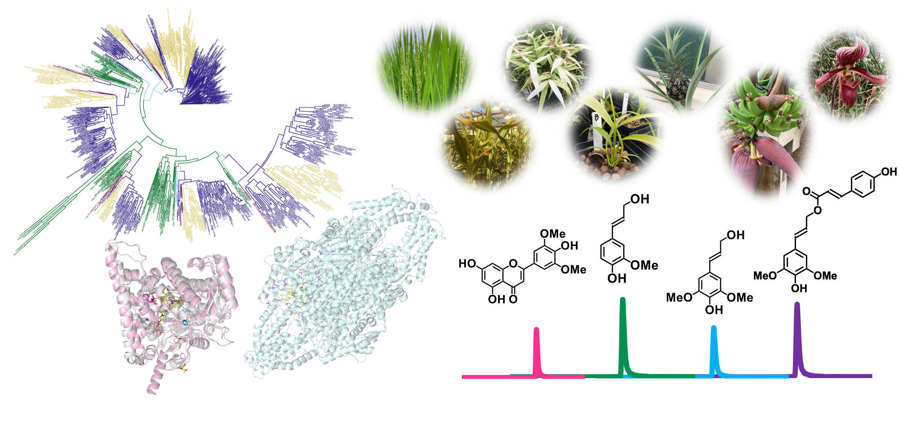

<meta name="google-site-verification" content="1Zld03pQVZMpXktMp7lfifzah7Nad-kHSfDCSV5474M" />

### 研究室の目標

ゲノム機能生化学分野では、植物のからだを支え水を移動させるのに必要不可欠な細胞壁成分「リグニン」を対象に、その生合成に関わる酵素の機能や制御のメカニズムを明らかにすることを目指しています。特に、ゲノム資源を活用したバイオインフォマティクス解析、生化学解析、遺伝学的解析等を通じて、陸上植物の進化に伴うリグニン生合成進化の分子機構の解明に取り組んでいます。さらに、得られる知見をリグニンの有効利用や有用芳香族系物質の高生産に役立てることを目指しています。

### 研究室の特徴

ゲノム機能生化学分野は2023年9月に発足しました。
ウィスコンシン大学Maeda研究室をはじめとする国内外の研究室と連携して研究を進めていく予定です。

キーワード：リグニン、フェニルプロパノイド、進化、代謝、ゲノム

関連する学術分野：生化学、分子生物学、分析化学、代謝工学

## News

2023.07.20 The 62th PSNA MeetingにてMaeda Labで行った研究に関する発表を行いました。

2023.07.09 ホームページを始めました！

