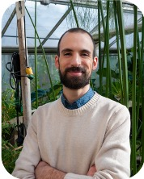

Maeda Lab at University of Wisconsin-Madison studies evolutionary diversification of core metabolic pathways (i.e. primary metabolism) in various plants through chemical, biochemical, genetic, and evolutionary analyses. For more information about our lab go to our [website](https://maeda.botany.wisc.edu/)

### People working on the projects:

**Hiroshi Maeda**     **Jorge El-Azaz**     **Beth Moore**  

**Caroline Hanson**     **Megan Gundrum** 

**Elaine Wang**      **Anika Gupta**     **Andrew Hall** 
