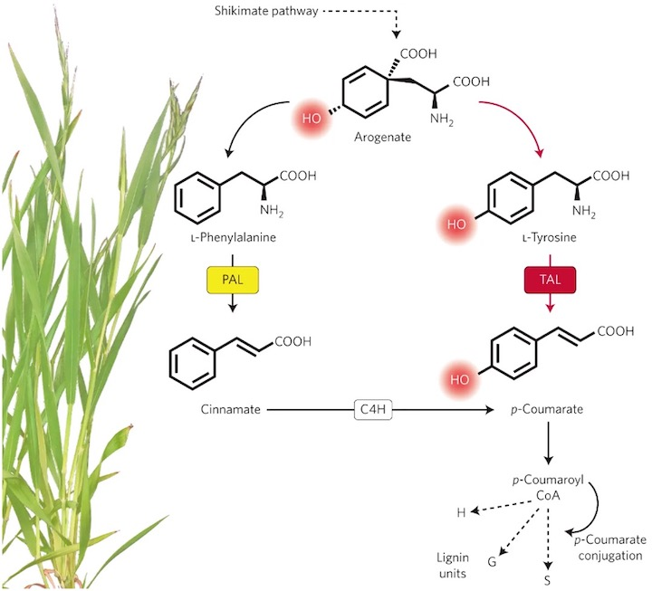
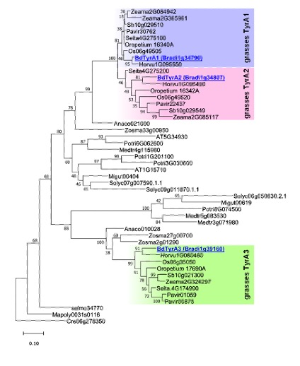
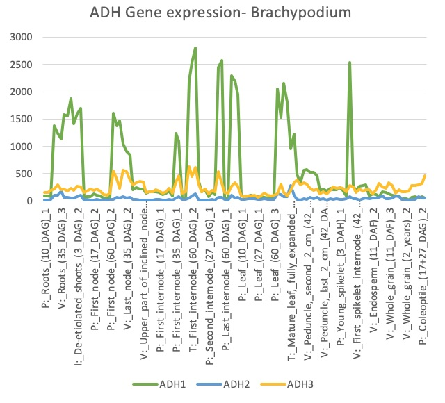
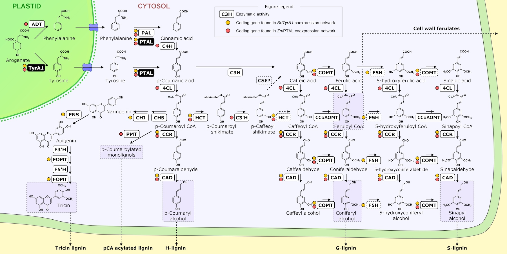

## Evolutionary timing of Tyr-lignin pathway:

While most of the plants synthesize lignin and other phenylpropanoid exclusively from L-phenylalanine, grasses have gained the ability to use tyrosine as a precursor of these family of compounds, shortcutting their biosynthesis **(Figure 1.1)**. This trait of grasses would have impacted the structure of their secondary cell walls, a topic of particular interest in biofuel research due to the extensive use of these family of plants as crops. Fundamental understanding of the tyrosine-derived lignin and other natural product pathways will enable optimization of amino acid and cell wall biosynthesis to improve yield and quality of foods, fuels, and biomaterials. Our phylogenetic analysis of a large set of PAL enzyme sequences from many monocots plants indicates that Histidine at position 89, a key residue for the use of tyrosine as alternative substrate (Barros and Dixon 2019), occurred for the first time in the grass ancestor *Joinvillea ascendens*. The mutation His-89 on PAL, that confers the ability to use tyrosine as substrate, occurred in the ancestors of grasses.

**Figure 1.1:** Grasses have the unique ability to synthesize secondary cell walls from tyrosine thanks to the novelty of PTAL enzymatic activity. Reproduced from <a href="https://doi.org/10.1038/nplants.2016.80"> Maeda, H. Lignin biosynthesis: Tyrosine shortcut in grasses. Nature Plants 2, 16080 (2016).</a>

**Figure 1.2:** Grasses have undergone a recent duplication in TyrA gene family giving rise to the isoforms TyrA1 and TyrA2, which do not exist in other monocots or dicots. In addition, grasses and other monocots have retained an additional isoform (TyrA3) that seems to have been lost in Arabidopsis and other dicots. 

## Molecular basis of Tyr-lignin pathway evolution ##

Utilizing the evolutionary history of TyrA and PTAL enzymes, a phylogeny-guided structure-function analyses is being conducted to define molecular basis of the evolution of the tyrosine-derived lignin pathway. In general, land plants give priority to the biosynthesis of phenylalanine over tyrosine through multiple levels of metabolic control: biochemical regulation of the enzymes, higher expression level of the enzymes for Phe biosynthesis, etc. But this does not seem to be the case of grasses, in which very high tyrosine levels have been reported. How do grasses accumulate such high amounts of tyrosine, presumably to fuel lignin biosynthesis? In most plants, the commitment enzyme for Tyr biosynthesis (arogenate dehydrogenase or TyrA) is inhibited by low levels of tyrosine, which contributes to channel the main bulk the arogenate pool -the common precursor for tyrosine and phenylalanine- into Phe. The biochemical characterization of multiple recombinant TyrA proteins has shown that these enzymes are frequently deregulated in grasses, meaning that their catalytic activity is not tightly repressed by Tyr as normally happens to other plants.

## Evolution of the Tyr-lignin metabolic network ##

To further identify gene/enzyme modules that co-evolved and reshaped the overall tyrosine-lignin biosynthetic network, a variety of phylogenomic, genomic and expression analyses will be conducted. We have developed co-expression networks in Brachypodium distachyon for each of the 3 TyrAs in that species, TyrA1, TyrA2, and TyrA3. TyrA1 was found to be more highly expressed than TyrA2 or TyrA3 (Figure 2.1). Furthermore, all three TyrAs form separate co-expression clusters that are enriched in different pathways (Figure 2.2). TyrA1 is co-expressed with many members of the lignin (phenylpropanoid) biosynthetic pathway such as PTAL,NCT, and CAD, and we find similar co-expression of homologous enzymes in maize (Figure 2.3). However TyrA3 co-expresses with the L-tyrosine biosynthesis pathway, and therefore may work together with TyrA1 to biosynthesize lignin from tyrosine.

**Figure 2.1** Expression profile of TyrA (ADH) genes in Brachypodium in a range of different tissue types.

**Figure 2.2** Pathway enrichment for TyrA 1, 2, and 3. Rows are pathways from Plant Metabolic Network and columns are different co-expression clusters. Color represents the negative log of the q-value from Fisher's Exact test, where a higher number is a a more highly enriched pathway (lower q-value).

**Figure 2.3** Lignin/Phenylpropanoid pathway map with enzymes and metabolites. Yellow dots indicate genes coexpressed with TyrA1 in Brachypodium, red dots indicate genes coexpressed with PTAL in maize.
