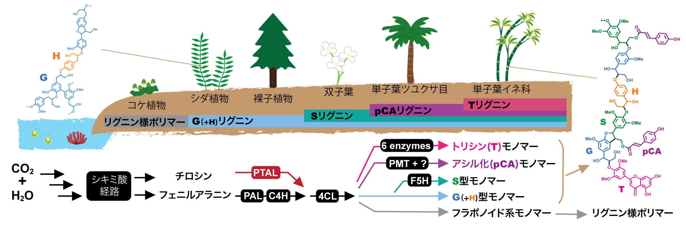

　植物は光エネルギーを利用して、二酸化炭素と水からさまざまな有機化合物を作り出すことができます。これらの植物代謝産物は、古くから建材やパルプ、食料、医薬品等、人々の生活をさまざまな面から支えてきました。化石資源に依らない持続的生産系が強く求められている今、ゲノム編集技術等を用いた代謝改変による植物代謝産物の効率的生産系や未利用成分の有効利用法の構築による植物資源のさらなる有効活用に期待が集まっています。
 
　リグニンは、植物二次細胞壁（木質バイオマス）の主要成分の１つであり、植物重量の最大３０％を占める、陸上で最も多量に存在する芳香族ポリマーです。従って、化石資源に代わる再生可能資源の中で、芳香族系の高分子材料や化成品を大量かつ安定的に供給できる原料として注目されています。しかし、リグニンは複雑多様な化学構造を有しているために、未だに有効な利用法は見出されていません。代謝工学的手法により、リグニンの構造を制御・改変することは、木質バイオマスの利用性を向上させるために有効と考えられます。 

　リグニンの代謝改変に取り組む上で重要な課題として、異なる植物グループや生育条件において、リグニンの化学構造を多様化している生物学的メカニズムの理解が挙げられます。**図１**に陸上植物の進化過程におけるリグニン生合成及び構造の変遷を示しています。現存する陸上植物のうち最も原始的であるとされているコケ植物はリグニンを産生しないものの、フラボノイド等が重合したリグニン様ポリマーを蓄積します。リグニン生合成機構を獲得したシダ植物や裸子植物では、ほぼG型モノマーのみが重合したG型リグニンが合成されます。また、被子植物のうち双子葉植物では、G型に加えS型モノマーが共重合したG/S型リグニンが合成され、さらに、単子葉植物の中でもイネ科植物では、G 型モノマー及びS 型モノマーに加え、それらにアシル基が付加したアシル化モノマーやフラボノイドであるトリシンも重合に寄与します。このように、リグニン構造は陸上植物の進化に伴い複雑化しているが、この多様化の根源にあるメカニズムに関する理解は大きく不足しています。これらの理解は、有用/高バイオマス産生植物の開発及び有用フェニルプロパノイド物質生産系の構築に重要と考えられます。
 

**Figure 1:** 陸上植物進化におけるリグニン部分構造及び生合成経路（フェニルプロパノイド経路）の多様化

