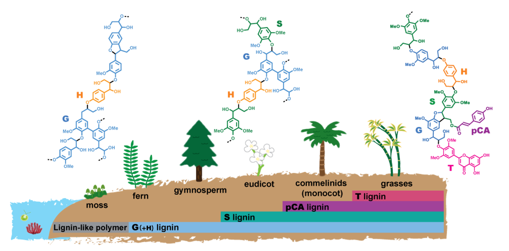
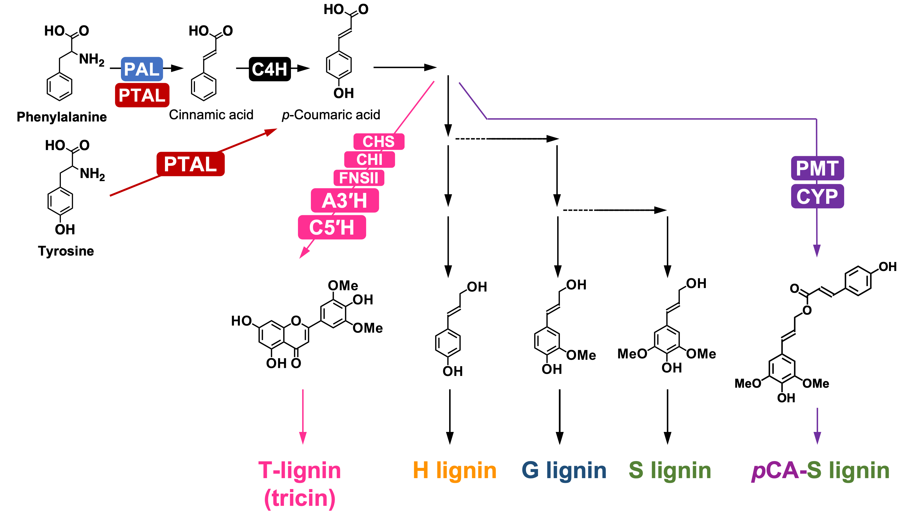

### **背景**

　植物は光エネルギーを利用して、二酸化炭素と水からさまざまな有機化合物を作り出すことができます。これらの植物代謝産物は、古くから建材やパルプ、食料、医薬品等、人々の生活をさまざまな面から支えてきました。化石資源に依らない持続的生産系が求められている今、ゲノム編集技術等を用いた代謝改変による植物代謝産物の効率的生産系や未利用成分の有効利用法の構築による植物資源の有効活用に期待が集まっています。
 
　リグニンは、植物二次細胞壁（木質バイオマス）の主要成分の１つであり、植物重量の最大３０％を占める、陸上で最も多量に存在する芳香族ポリマーです。従って、化石資源に代わる再生可能資源の中で、芳香族系の高分子材料や化成品を大量かつ安定的に供給できる原料として注目されています。しかし、リグニンは複雑な化学構造を有しているために、未だに有効な利用法は見出されていません。代謝工学的手法により、リグニンの構造を制御・改変することは、木質バイオマスの利用性を向上させるために有効と考えられます。 

　リグニンの代謝改変に取り組む上で重要な課題として、異なる植物グループや生育条件において、リグニンの化学構造を多様化している生物学的メカニズムの理解が挙げられます。**Figure 1**に陸上植物の進化過程におけるリグニン構造の変遷を示しています。現存する陸上植物のうち最も原始的であるとされているコケ植物はリグニンを産生しないものの、フラボノイド等が重合したリグニン様ポリマーを蓄積します。リグニン生合成機構を獲得したシダ植物や裸子植物では、ほぼG型モノマーのみが重合したG型リグニンが合成されます。また、被子植物のうち双子葉植物では、G型に加えS型モノマーが共重合したG/S型リグニンが合成され、さらに、単子葉植物の中でもイネ科植物では、G型モノマー及びS型モノマーに加え、それらにアシル基が付加したアシル化モノマーやフラボノイドであるトリシンも重合に寄与します。このように、リグニン構造は陸上植物の進化に伴い複雑化していますが、この多様化の根源にあるメカニズムに関する理解は大きく不足しています。
 

**Figure 1:** 陸上植物進化におけるリグニン部分構造の変遷

### **これまでの研究活動**

　これまでの研究は主に、農業上及び経済的に重要な穀物を含み、また成長速度の速さからバイオマス原料植物として注目されているイネ科植物に焦点を当てて進めてきました。
 
　京都大学 梅澤研究室では、イネ科リグニンにおけるG型/S型/H型モノマー組成の制御を目指し、フェニルプロパノイド経路上のG型/S型/H型モノマー生合成の分岐点で作用する2つの水酸化酵素遺伝子の発現を制御した組換えイネを作出しました。それらのイネ株に対するリグニン構造の詳細解析を通じて、これらの遺伝子の発現制御がリグニンのG/S/Hモノマー組成の改変に有効であることを示しました（<a href="https://link.springer.com/article/10.1007/s00425-017-2692-x">Takeda et al., 2017</a>, <a href="http://dx.doi.org/10.1111/tpj.13988">2018</a>）。各イネ株のリグニン構造を詳細に解析し、イネ科植物に特有のアシル化リグニンの合成に関わる未知のリグニン生合成経路の存在を示唆する知見も得ました（<a href="http://dx.doi.org/10.1111/tpj.13988">Takeda et al., 2018</a>, <a href="http://dx.doi.org/10.1111/tpj.14141">2019a</a>）。さらに、得られたイネ株リグニンの芳香核組成とバイオマス利用特性の相関解析を通じて、リグニンの芳香核組成の制御がバイオマスの酵素糖化効率や燃焼発熱量の向上に寄与することを見出しました（<a href="http://dx.doi.org/10.1186/s10086-019-1784-6">Takeda et al., 2019b</a>）。

　ウィスコンシン大学Maeda研究室では、イネ科リグニン生合成多様化の起源と分子機構の解明に向けた研究を進めています。イネ科植物はユニークなリグニン代謝ネットワークを有しています（**Figure 2**）。通常リグニンは芳香族アミノ酸フェニルアラニンを前駆体に合成されますが、イネ科植物はフェニルアラニンに加えてチロシンからもリグニンを合成することができます。さらに、イネ科植物は、被子植物に典型のH型、G型、S型リグニンに加えて、アシル化リグニンやトリシンリグニンも合成します。しかし、イネ科植物系統において、これらの異なる特徴がいつ、どのように獲得されたのか、その進化的経緯はほとんどわかっていません。本研究では、イネ科姉妹種のゲノム資源を活用し、バイオインフォマティクスと生化学的アプローチを組み合わせることで、イネ科植物リグニンのネットワークが段階的に進化したことを見出しました。（論文投稿準備中）

 

**Figure 2:** イネ科植物におけるリグニン生合成経路の概略図

### **これからの研究**

　これまでイネ科リグニンの形成にユニークに関わる酵素群の進化的起源の解明に取り組んできました。しかし、これらイネ科植物リグニン形成の⾰新的進化に伴いリグニン生合成制御機構がどのように変化したかについてはほとんどわかっていません。さらには、陸上植物におけるリグニン生合成制御機構の進化的起源や多様性に関する研究も進んでいません。そこで、今後は、イネ科及び陸上植物におけるリグニン生合成の制御機構進化に着目した研究を進める予定です。さらに、得られる知見を基に、代謝工学によりリグニンの代謝制御や有用芳香族化合物の生産性への寄与を調査し、植物資源の有効利用に向けたゲノム編集ターゲットを提供したいと考えています。
